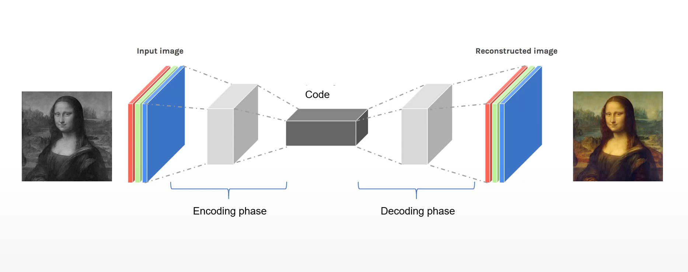

# Colorization-Model

### **Project Summary** 🏞️

This project is a deep learning model designed to automatically colorize grayscale images using a Convolutional Neural Network. The model was trained on a dataset of landscape photographs 🌄, where it learns to predict the missing color information.

---

### **Methodology** ⚙️

The core idea is based on the **LAB color space**, which separates light intensity (L channel) from the color components (a and b channels). The model follows these steps:

1.  **Input 📥:** The model takes only the L channel from the grayscale image, which represents the brightness values.
2.  **Model Architecture 🏗️:** The model is built as a **Convolutional Autoencoder** with **Skip Connections** (similar to a U-Net architecture).
    * **Encoder:** Compresses the input image (L channel) to extract its essential features.
    * **Decoder:** Reconstructs the image from the extracted features, using skip connections to preserve fine-grained details from the corresponding encoder layers.
3.  **Output 📤:** The model predicts the a and b channels, which contain the red-green and blue-yellow color information, respectively.
4.  **Final Image Reconstruction 🖼️:** The original L channel is combined with the model's predicted a and b channels to form a complete, colorful LAB image. This is then converted back to the RGB color space for display.

---

### **Tools & Technologies Used** 🛠️

* **Framework:** PyTorch
* **Core Libraries:** TorchVision, Scikit-image, Matplotlib, NumPy
* **Model Architecture:** Convolutional Autoencoder (U-Net like)
* **Color Space:** CIELAB (LAB)
* **Loss Function:** Mean Squared Error (MSE)
* **Optimizer:** Adam Optimizer
